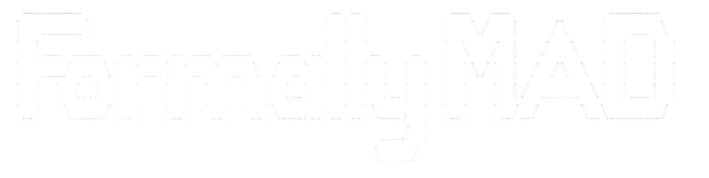

<div align='center'>
    <picture>
        <source media="(prefers-color-scheme: light)" srcset="./docs/lightmode-logo-formallymad.png">
        
    </picture>
</div>


# Formally MAD - Agent Coordination Framework
Start by cloning the **GitHub** repository, then create and activate a virtual environment before installing with `pip`:

```bash
python -m venv .venv
```
```bash
source .venv/bin/activate
```
```bash
pip install -e .
```